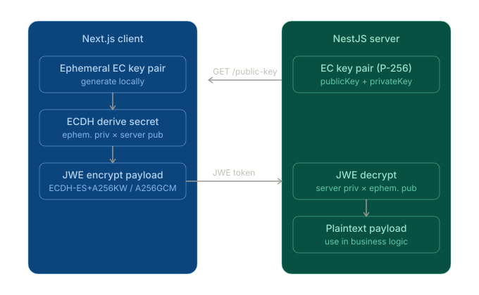

# jose-ecdh-monorepo

Turborepo monorepo ตัวอย่างการใช้ JOSE + ECDH-ES สำหรับ encrypt payload
ระหว่าง Next.js client และ NestJS server

```
jose-ecdh-monorepo/
├── apps/
│   ├── api/          → NestJS (port 3001)
│   └── web/          → Next.js (port 3000)
├── packages/
│   └── jose-utils/   → shared encrypt / decrypt / keygen helpers
├── turbo.json
├── pnpm-workspace.yaml
└── package.json
```

## Quick start

```bash
# 1. ติดตั้ง dependencies ทั้งหมด (ต้องใช้ pnpm)
pnpm install

# 2. build shared package ก่อน
pnpm --filter @repo/jose-utils build

# 3. รัน dev ทุก app พร้อมกัน (Turborepo จัดการ order ให้)
pnpm dev
```

เปิดเบราว์เซอร์ที่ `http://localhost:3000`

## Stack

| Package | เวอร์ชัน | หน้าที่ |
|---|---|---|
| `turbo` | ^2 | task orchestration, caching |
| `pnpm workspaces` | ^9 | dependency management |
| `jose` | ^5 | JOSE / JWE / ECDH-ES |
| `@nestjs/*` | ^10 | REST API server |
| `next` | ^15 | React frontend |

## การทำงาน



1. **Server boot** — `EcKeysService.onModuleInit()` สร้าง EC P-256 key pair
2. **Client load** — `usePublicKey()` fetch `GET /crypto/public-key` (JWK)
3. **Encrypt** — `encryptPayload()` ใน `@repo/jose-utils` สร้าง ephemeral key → ECDH derive → wrap CEK → A256GCM encrypt → compact JWE
4. **Send** — POST JWE token ไปที่ `POST /crypto/decrypt`
5. **Decrypt** — server ใช้ private key ถอดรหัส → คืน plaintext payload

## Production checklist

- [ ] เก็บ private key ใน KMS หรือ secrets manager (ไม่ใช่ in-memory)
- [ ] Rotate key pair เป็นประจำ
- [ ] ใช้ JWE ใน Guard/Pipe แทนที่จะ expose `/decrypt` endpoint โดยตรง
- [ ] เพิ่ม `exp` claim ใน payload เพื่อกัน replay attack
- [ ] ใช้ HTTPS ใน production (TLS + ECDH = defence in depth)
